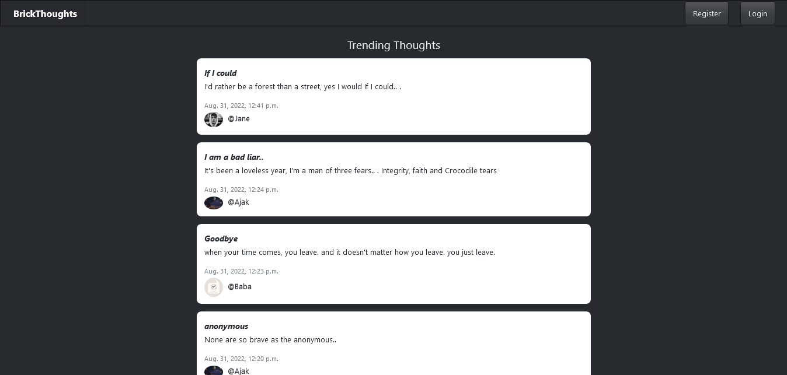

# Brickthoughts

A thoughts sharing social media app.

#### Tech Stack
  - Django
  - Bootstrap
  - JavaScript
  - HTML/CSS
  - AWS S3 / Postgres
  - Heroku
  

### App features
* User Profile
* User profile management
* Create, read, Update and delete posts
* Create, read, Update and delete profiles
* View users profiles and posts
* User own dashboard and profile management page
* User's posts page
* Register and login
* Password reset by sending a link to the email address
* Welcome email address
* Image upload

# Project Screenshots

### Home Page

### User SignUp Page

### User Login Page

### User Profile Page

### Password Reset Email Sending Form

### Dashboard

### Profile Update Page

